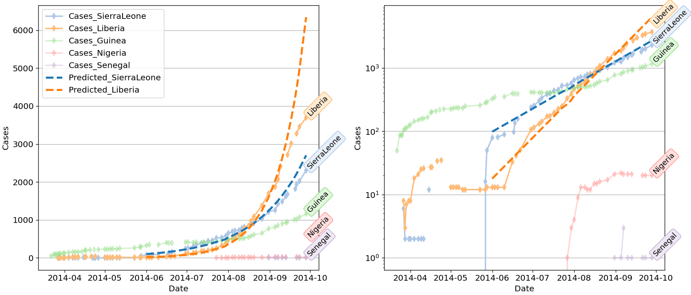

# codee_ebola
This is code and data for a visualization related to 2014 Ebola epidemic data in West Africa
Data sources here are copied from https://github.com/cmrivers/ebola/tree/master/data_products

